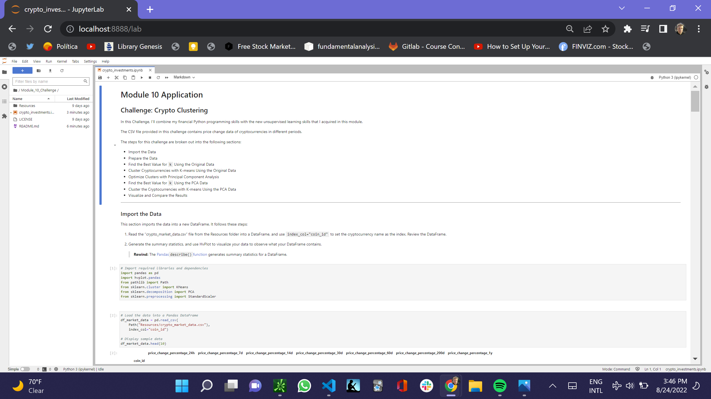

# Crypto K-Means Clustering Project

I’ll combine my financial Python programming skills with the new unsupervised learning skills that I acquired in this module.

The CSV file provided in this challenge contains price change data of cryptocurrencies in different periods.

The steps for this challenge are broken out into the following sections:

- Import the Data
- Prepare the Data
- Find the Best Value for `k` Using the Original Data
- Cluster Cryptocurrencies with K-means Using the Original Data
- Optimize Clusters with Principal Component Analysis
- Find the Best Value for `k` Using the PCA Data
- Cluster the Cryptocurrencies with K-means Using the PCA Data
- Visualize and Compare the Results

---

## Technologies

This was developed with Anaconda, in a development environment running Python 3.7.13, which includes Pandas, and in addition scitkit-leran with Kmeans, PCA, StandardScaler.

---

## Installation Guide

Install Anaconda and Python 3.7.13. </br>
pip install -U scikit-learn
Git clone the repo and run it

In the terminal type 'Jupyter Lab'

---

## Usage

The following images present the first notebook read in Jupyter Lab.

##  </br>

---

## Contributors


My contact information is:

Name: Jeffrey M. Smith </br>
Linkedin: https://www.linkedin.com/in/jeffsmith77/ </br>
Personal email: jsmith@lexsmith.finance</br>

---

## License

MIT License

Copyright (c) 2022 Jeffrey M. Smith

Permission is hereby granted, free of charge, to any person obtaining a copy of this software and associated documentation files (the "Software"), to deal in the Software without restriction, including without limitation the rights to use, copy, modify, merge, publish, distribute, sublicense, and/or sell
copies of the Software, and to permit persons to whom the Software is furnished to do so, subject to the following conditions:

The above copyright notice and this permission notice shall be included in all copies or substantial portions of the Software.

THE SOFTWARE IS PROVIDED "AS IS", WITHOUT WARRANTY OF ANY KIND, EXPRESS OR IMPLIED, INCLUDING BUT NOT LIMITED TO THE WARRANTIES OF MERCHANTABILITY, FITNESS FOR A PARTICULAR PURPOSE AND NONINFRINGEMENT. IN NO EVENT SHALL THE AUTHORS OR COPYRIGHT HOLDERS BE LIABLE FOR ANY CLAIM, DAMAGES OR OTHER LIABILITY, WHETHER IN AN ACTION OF CONTRACT, TORT OR OTHERWISE, ARISING FROM, OUT OF OR IN CONNECTION WITH THE SOFTWARE OR THE USE OR OTHER DEALINGS IN THE
SOFTWARE.

```

```
